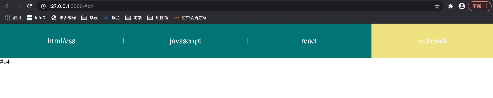
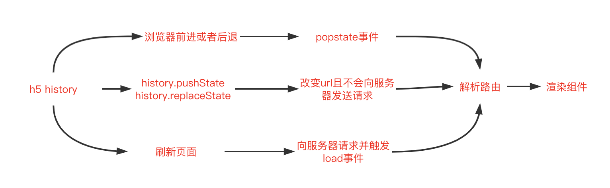

# 前端开发怎么能不知道两种SPA路由方式

单页应用（Single Page Application,简称SPA）是指web应用可以无刷新在不同页面间切换，并且页面访问记录会被浏览器保存，从而支持浏览器的前进、后退和刷新等操作

单纯的我一直以为实现SPA的路由跳转只有哈希路由，一次面试官问我的时候，我就没有答上来，这里好好讲一下

## 概念

### 什么是hash路由？

我们在浏览网站的时候经常会看到`https://www.xxx.com#!/product`，这样通过`#!`的方式被叫做hash路由，但是这个`#!`的分隔符不是固定的


### 什么是history路由

history路由比如`https://www.xxx.com/product`和`https://www.xxx.com/index`

## 实现

### hash路由实现单页应用

进入`02hash`路径下面👇，在命令行输入`http-server -p 3000` 启动本地服务
访问`http://127.0.0.1:3000/`可以查看效果，点击导航栏不同的目录，看到路由切换后的效果


#### 关键技术点
- location.hash
- window.onhashchange
- 事件冒泡

#### 关注核心代码

下面是html代码，我们定义4个目录，想要实现点击不同的目录进行hash路由的跳转

```html
<ul id="header">
    <li id="c1">html/css</li>
    <p>|</p>
    <li id="c2">javascript</li>
    <p>|</p>
    <li id="c3">react</li>
    <p>|</p>
    <li id="c4">webpack</li>
</ul>
```

下面是关键的js代码，设置监听事件，判断被点击的元素的id，并设置`location.hash`的值为对应的id，可以通过`window.onhashchange`监听到hash的变化，设置不同的效果

```javascript
const header = document.getElementById("header");
header.addEventListener('click', function(evt) {
    evt = evt || window.event;
    const target = evt.srcElement || evt.target
    switch (target.id) {
        case "c1":
        case "c2":
        case "c3":
        case "c4":
            location.hash = target.id; // 设置跳转的hash为当前的id
            $(`#${target.id}`).addClass('active').siblings().removeClass('active');
            break;
        default:
            console.log("什么都没有点击到")
            break;
    }
})
window.onhashchange = function(hashEvt) {
    $('section').html(location.hash);
}
```

### history实现单页应用路由

#### 关键技术点
 - history.pushState(data,title,targetUrl); 只填入最后一个参数就好
 - window.onpopstate; 页面前进或者回退

#### 关注核心代码

其他代码同hash实现路由跳转相同

```javascript
const refreshPage = function(id) {
    // 刷新页面的函数
    $(`#${id}`).addClass('active').siblings().removeClass('active');
    $('section').html(id);
}
const header = document.getElementById("header");
header.addEventListener('click', function(evt) {
    evt = evt || window.event;
    const target = evt.srcElement || evt.target
    switch (target.id) {
        case "c1":
        case "c2":
        case "c3":
        case "c4":
            history.pushState("", "",target.id)
            refreshPage(target.id);
            break;
        default:
            console.log("什么都没有点击到")
            break;
    }
})

window.addEventListener("popstate", function(evt) {
    // 监听页面前进或者后退
    console.log(location.pathname) // /c3
    refreshPage(location.pathname.substring(1))
})
```

## 原理




## 对比

### hash路由
- 占用锚点
- 兼容性好，适用于所有浏览器

### history
- 兼容性差，不适用于不支持history的浏览器
